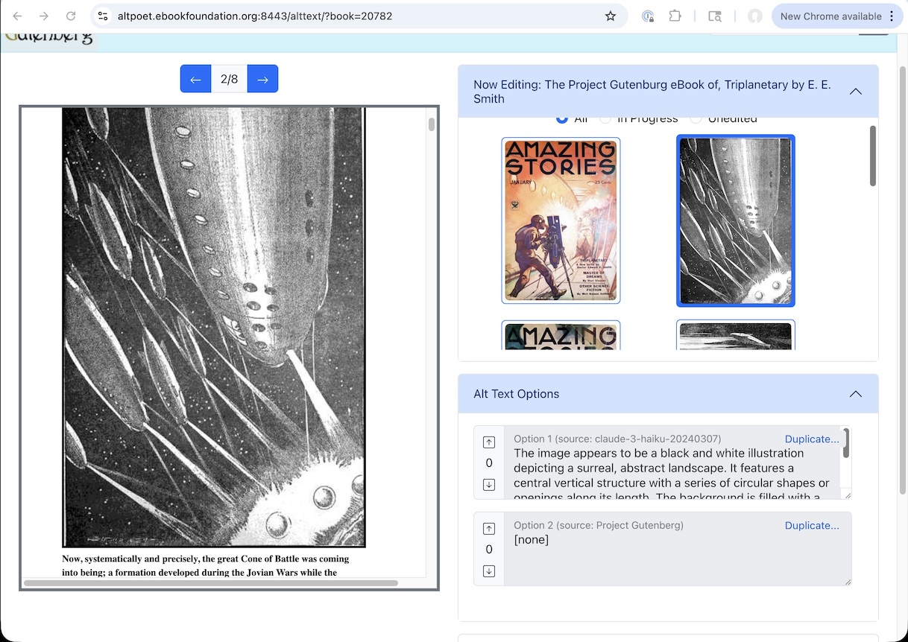

# alt-text-editor
<b> Free Ebook Foundation's + Project Gutenberg's Altpoet Frontend </b>

Made for volunteers and alt text writers to easily create alt texts for Project Gutenberg Ebooks and improve accessibility

<!-- TABLE OF CONTENTS -->

  
Table of Contents

  <ol>
    <li>
      <a href="#set-up-altpoet-backend">Set Up Altpoet Backend</a>
    </li>
    <li>
      <a href="#setting-up-react-app-locally-for-development">Setting up React app locally for development</a>
    </li>
    <li>
      <a href="#nodejs-proxy-server-and-how-it-works-with-react-and-vite">NodeJS proxy server and how it works with React and Vite</a>
    </li>
    <li>
      <a href="#updating-production">Updating Production</a>
    </li>
  </ol>

## Sample Image

[]

## Set Up Altpoet Backend

This project requires you already have the <b>[Altpoet backend](https://github.com/EbookFoundation/altpoet)</b> running locally, and assumes it is serving endpoints at [http://127.0.0.1:8000/](http://127.0.0.1:8000/). You can change what URL and port the React app looks for in `alt-text-react-app/.env` by changing the `DATABASE_URL` variable. 

NOTE: You will need to create a user and be logged in to your local instance of the Altpoet backend as well.

## Setting up React app locally for development

`alt-text-react-app` uses NodeJS v22.13.1 and npm v10.9.2 for this project. Older (or newer) versions shouldn't matter unless they're really old but if there's issues compiling or executing the version numbers are here for reference. Docker <i> is not </i> an option because proxy server communication doesn't work between containers, so you'll have to run it locally. Instructions to do so are as follows:

Clone the repo and open terminal/CLI ("terminal 1") in `alt-text-react-app` directory. Make sure you have NodeJS and npm installed. In order, that's as follows:
   1. `git clone git@github.com:EbookFoundation/alt-text-editor.git`
   2. `cd alt-text-editor/alt-text-react-app`
   3. `npm install`
   
Then, open a separate terminal ("terminal 2") in the `alt-text-test-server` directory and run `webserver.js` in it:
   1. `cd alt-text-editor/alt-text-test-server`
   2. `node webserver.js`

Then, back in terminal 1:
   1. `npm run dev`

You should now be able to access the React app at [http://127.0.0.1:5173/](http://127.0.0.1:5173/) on your machine in any browser.

You can change the port in `alt-text-react-app/vite.config.js`.

## NodeJS proxy server and how it works with React and Vite

`alt-text-test-server/index.html` is the Project Gutenberg Ebook of Winnie the Pooh, and `alt-text-test-server/webserver.js` is a NodeJS server that hosts the page and the static image files at [http://127.0.0.1:8080/](http://127.0.0.1:8000/) when running. If you need to change the localhost port, you need to do so in both `alt-text-test-server/webserver.js` and `alt-text-react-app/vite.config.js`.

The React app uses the `vite.config.js` file to proxy [http://127.0.0.1:8080/](http://127.0.0.1:8080/) as if they were subpages of the localhost port that it's running on. The node webserver hosts the html file at '/iframe', and the images at '/images', which the React app is redirected to by `vite.config.js` when it makes GET requests. This eliminates CORS issues re: being able to access the DOM of the Project Gutenberg Winnie the Pooh HTML.

This doesn't work with Docker, because Docker can only proxy within its own containers, not between. It also means that this way of testing only works on the dev build, not the production build, because the `vite.config.js` file isn't included (like `package.json`), hence `npm run dev` instead of `npm run build` and `serve -s dist`. 

You can ignore the .csv file, the Python script with .env dependency files, and the alt text JSON assets. They exist just to download images and alt texts for local hosting, in case you're running an early version that doesn't have the altpoet backend or the files for whatever reason.

## Updating Production

The production instance of the alt-text-editor is now downstream from the Free Ebook Foundation fork of [Rowan McKereghan's original repo](https://github.com/Rowan-McKereghan/alt-text-editor).

If you want to update the production instance of the frontend, merge with main branch of the Ebook Foundation fork, and run:

1. `git pull origin main` to load your new code
2. `npm run build` to create the production build
3. `sudo nginx -s reload` to serve on live URL

Please look at the nginx config file on the production server before you start changing any other config or env files on the production build.
